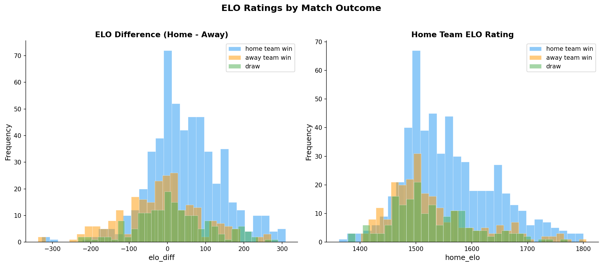

# FIFA Men's World Cup Match Outcome Prediction

**Course**: CSE 40467 — Data Science
**Project**: Course Project (Parts 1 & 2)
**Research Question**: Can we predict FIFA Men's World Cup match outcomes (home win, away win, or draw) using only pre-match information?

---

## Table of Contents

1. [Dataset](#1-dataset)
2. [Project Structure](#2-project-structure)
3. [Setup & Reproduction](#3-setup--reproduction)
4. [Part 1 — Data Description & EDA](#4-part-1--data-description--eda)
5. [Part 2 — Feature Engineering](#5-part-2--feature-engineering)
6. [Part 2 — Modeling & Evaluation](#6-part-2--modeling--evaluation)
7. [Results](#7-results)
8. [Unsupervised Analysis](#8-unsupervised-analysis)
9. [Discussion & Limitations](#9-discussion--limitations)
10. [Conclusion](#10-conclusion)
11. [References](#11-references)

---

## 1. Dataset

| Property | Value |
|----------|-------|
| **Source** | [The Fjelstul World Cup Database v1.2.0](https://github.com/jfjelstul/worldcup) by Joshua C. Fjelstul, Ph.D. |
| **Scope** | All FIFA Men's World Cup matches, 1930--2022 |
| **Training set** | 900 matches from 21 tournaments (1930--2018) |
| **Test set** | 64 matches from 1 tournament (2022) |
| **Distinct teams** | 84 national teams |
| **Unit of analysis** | One row per match per tournament |
| **Target variable** | `result` — 3 classes: *home team win* (57.0%), *away team win* (24.2%), *draw* (18.8%) |


### Raw Variables (38 columns)

The raw match data includes: tournament/match identifiers, stage information (`group_stage`, `knockout_stage`, `stage_name`), team names and codes, scores (`home_team_score`, `away_team_score`), extra time/penalty indicators, venue details (`stadium_name`, `city_name`, `country_name`), and outcome labels (`result`, `home_team_win`, `away_team_win`, `draw`).

---

## 2. Project Structure

```
datascienceproject/
├── files_needed/               # Raw source data (not modified)
│   ├── matches.csv             #   All WC matches (men's & women's)
│   └── tournaments.csv         #   All tournaments with year info
│
├── scripts/
│   ├── clean_worldcup.py       # Part 1: data cleaning & train/test split
│   └── feature_engineering.py  # Part 2: 37-feature engineering pipeline
│
├── data_clean/
│   ├── matches_train.csv       # Cleaned matches, 1930-2018 (900 rows, 38 cols)
│   ├── matches_test.csv        # Cleaned matches, 2022 (64 rows, 38 cols)
│   ├── features_train.csv      # Engineered features (900 rows, 42 cols)
│   └── features_test.csv       # Engineered features (64 rows, 42 cols)
│
├── docs/
│   └── worldcup_subset_codebook.csv  # Data dictionary
│
├── figures/                    # Generated visualizations (11 PNGs)
├── Data Science Report.ipynb   # Part 1: Exploratory Data Analysis
├── Part2_Models_and_Results.ipynb  # Part 2: Models, evaluation, results
├── requirements.txt            # Python dependencies
└── README.md                   # This file
```

### Data Flow

```
files_needed/matches.csv + tournaments.csv
        │
        ▼  scripts/clean_worldcup.py
data_clean/matches_train.csv + matches_test.csv   (cleaned, split)
        │
        ▼  scripts/feature_engineering.py
data_clean/features_train.csv + features_test.csv  (37 features)
        │
        ▼  Part2_Models_and_Results.ipynb
        7 models → temporal CV → test evaluation → results
```

---

## 3. Setup & Reproduction

### Requirements

- Python 3.10+
- Core: `pandas>=2.0.0`, `numpy`, `matplotlib`, `seaborn`
- ML: `scikit-learn`, `xgboost`
- Optional: `imblearn` (for SMOTE experiment)

### Steps

```bash
# 1. Install dependencies
pip3 install pandas numpy matplotlib seaborn scikit-learn xgboost

# 2. Generate cleaned data (from project root)
python3 scripts/clean_worldcup.py

# 3. Generate engineered features
python3 scripts/feature_engineering.py

# 4. Run the notebooks
#    - Data Science Report.ipynb  (Part 1 EDA)
#    - Part2_Models_and_Results.ipynb  (Part 2 modeling)
```

The Part 2 notebook will auto-run `feature_engineering.py` if the feature CSVs are missing.

---

## 4. Part 1 — Data Description & EDA

**Notebook**: `Data Science Report.ipynb`

Part 1 focuses on understanding the dataset before modeling:

- **Data overview**: Shape, dtypes, `info()`, `describe()` for numerical and categorical columns.
- **Missing value analysis**: Identification and assessment of data quality issues.
- **Class balance**: The target `result` is imbalanced — home team wins dominate at ~57%, with draws the minority class at ~19%.
- **Feature distributions**: Histograms for scores, margins, and penalty columns.
- **Correlation heatmap**: Relationships among numerical features and outcome indicators.
- **Data cleaning** (`scripts/clean_worldcup.py`):
  - Filtered to men's World Cups only (from combined men's + women's data).
  - Parsed dates, cast booleans to 0/1 integers, ensured numeric score columns.
  - Split by tournament year: train (1930--2018), test (2022).

---

## 5. Part 2 — Feature Engineering

**Script**: `scripts/feature_engineering.py`
**Output**: `features_train.csv` (900 x 42), `features_test.csv` (64 x 42)

All features are **leakage-safe**: they use only information available *before* the current match. The pipeline concatenates train + test, computes features chronologically, then splits back.

### 37 Engineered Features (9 categories)

#### A. Team Historical Performance (12 features)
Expanding-window aggregates over all prior World Cup matches, shifted by one date-slot to prevent same-day leakage.

| Feature | Description |
|---------|-------------|
| `home/away_hist_win_rate` | Cumulative win rate in all prior WC matches |
| `home/away_hist_draw_rate` | Cumulative draw rate |
| `home/away_hist_goals_per_game` | Cumulative goals scored per match |
| `home/away_hist_goals_conceded_per_game` | Cumulative goals conceded per match |
| `home/away_hist_matches_played` | Total prior WC matches played |
| `hist_win_rate_diff` | Home win rate minus away win rate |
| `hist_goals_per_game_diff` | Home GPG minus away GPG |

#### B. Match Context (3 features)

| Feature | Description |
|---------|-------------|
| `is_group_stage` | 1 if group stage, 0 otherwise |
| `is_knockout` | 1 if knockout stage |
| `stage_ordinal` | Ordinal encoding: group=0, R16=2, QF=3, SF=4, 3rd=5, Final=6 |

#### C. Host Advantage (2 features)

| Feature | Description |
|---------|-------------|
| `home_is_host` | 1 if the home team is the host nation |
| `away_is_host` | 1 if the away team is the host nation |

#### D. World Cup Experience (3 features)

| Feature | Description |
|---------|-------------|
| `home/away_wc_appearances` | Number of distinct prior WC tournaments the team appeared in |
| `wc_appearances_diff` | Home appearances minus away appearances |

#### E. Head-to-Head Record (5 features)

| Feature | Description |
|---------|-------------|
| `h2h_home_wins` | Prior meetings won by the current home team (regardless of prior home/away designation) |
| `h2h_away_wins` | Prior meetings won by the current away team |
| `h2h_draws` | Prior meetings that ended in a draw |
| `h2h_total` | Total prior meetings between the two teams |
| `h2h_home_win_rate` | Home team's win rate in prior meetings (default 0.33 for first meeting) |

#### F. ELO Ratings (3 features)

| Feature | Description |
|---------|-------------|
| `home_elo` | Pre-match ELO rating (all teams start at 1500, K=32) |
| `away_elo` | Pre-match ELO rating |
| `elo_diff` | `home_elo - away_elo` |

ELO ratings are updated sequentially after each match using the standard formula:

```
E_home = 1 / (1 + 10^((R_away - R_home) / 400))
R_home_new = R_home + K * (S_home - E_home)
```

Where S = 1 for win, 0.5 for draw, 0 for loss.

#### G. Rolling Form — Last 5 Matches (4 features)

| Feature | Description |
|---------|-------------|
| `home/away_rolling5_win_rate` | Win rate over last 5 WC matches (shifted by 1) |
| `home/away_rolling5_goals_pg` | Goals per game over last 5 WC matches (shifted by 1) |

Cold-start fallback: teams with fewer than 5 prior matches use all-time rate; teams with no prior matches default to 0.33 / 0.0.

#### H. Rest Days (2 features)

| Feature | Description |
|---------|-------------|
| `home/away_rest_days` | Days since team's previous WC match, capped at 365 |

First-match NaNs filled with the median rest value.

#### I. Interaction Features (3 features)

| Feature | Description |
|---------|-------------|
| `home_attack_x_away_defense` | `home_hist_goals_pg * away_hist_goals_conceded_pg` |
| `away_attack_x_home_defense` | `away_hist_goals_pg * home_hist_goals_conceded_pg` |
| `elo_x_form_diff` | `elo_diff * (home_rolling5_win_rate - away_rolling5_win_rate)` |




### Missing Value Strategy

| Feature Type | Fill Value | Rationale |
|-------------|------------|-----------|
| Rate features (win rate, draw rate) | 0.33 | Uniform prior for 3-class problem |
| Count features (matches played, appearances) | 0 | No prior history = zero |
| Goals rate features | 0.0 | Conservative cold-start assumption |
| ELO ratings | 1500.0 | Starting ELO for all teams |
| Rest days | Median of existing values | Central tendency fallback |
| Interaction features | 0.0 | Product of zero-filled components |

---

## 6. Part 2 — Modeling & Evaluation

**Notebook**: `Part2_Models_and_Results.ipynb`

### Preprocessing

1. **Feature matrix**: 37 numeric features (metadata and target dropped).
2. **Scaling**: `StandardScaler` fit on training data, applied to both train and test.
3. **Target encoding**: `LabelEncoder` maps result strings to integers.

### Evaluation Framework

#### Temporal Walk-Forward Cross-Validation

Standard k-fold CV **shuffles data across time**, allowing models to train on 2018 data and validate on 2010 data — creating temporal leakage. Walk-forward CV respects chronology:

| Fold | Training Data | Validation Data | Train Size | Val Size |
|------|--------------|----------------|------------|----------|
| 1 | 1930--2006 | 2010 | ~770 | ~64 |
| 2 | 1930--2010 | 2014 | ~834 | ~64 |
| 3 | 1930--2014 | 2018 | ~898 | ~64 |

Both temporal CV and stratified 5-fold CV are reported so the reader can see how much random CV overestimates performance.

#### Metrics

| Metric | Description |
|--------|-------------|
| **Accuracy** | Fraction of correct predictions |
| **Macro F1** | Unweighted average of per-class F1 (penalizes poor minority-class performance) |
| **RPS** (Ranked Probability Score) | Measures quality of predicted probabilities for ordinal outcomes (lower = better). Assumes ordering: away win < draw < home win |
| **Confusion matrix** | Per-class TP/FP/FN/TN breakdown |
| **Classification report** | Per-class precision, recall, F1 |
| **Calibration curves** | Reliability diagram for the best model's predicted probabilities |

### Models

#### 6a. K-Nearest Neighbors (KNN)
- **Tuning**: k in {3, 5, 7, 9} via temporal CV.
- Distance-based; relies on StandardScaler for feature normalization.

#### 6b. Decision Tree
- **Tuning**: `max_depth` in {3, 5, 7, 10, None} via temporal CV.
- Feature importance analysis included.

#### 6c. Naive Bayes (GaussianNB)
- Assumes features are conditionally independent given the class.
- No hyperparameters to tune.

#### 6d. SVM (RBF Kernel)
- **Tuning**: C in {0.1, 1, 10, 100} via temporal CV.
- `class_weight='balanced'` to address class imbalance.
- Probability calibration enabled for RPS computation.

#### 6e. Random Forest
- 200 trees, `class_weight='balanced'`.
- Feature importance analysis included.

#### 6f. Neural Network (MLPClassifier)
- Architecture: 64 -> 32 hidden layers.
- Early stopping enabled, max 500 iterations.

#### 6g. XGBoost
- **Why added**: Native L1/L2 regularization (`reg_alpha=0.5`, `reg_lambda=2.0`), handles feature interactions efficiently, strong in sports prediction benchmarks.
- **Tuning**: 3 configurations tested via temporal CV:
  - `max_depth=3, n_estimators=200, lr=0.05`
  - `max_depth=4, n_estimators=150, lr=0.08`
  - `max_depth=5, n_estimators=100, lr=0.1`
- Draw upweighting: draws given 1.5x sample weight.

### Class Imbalance Handling

Three strategies compared for RF, SVM, and XGBoost:

| Strategy | Description |
|----------|-------------|
| **Default** | No reweighting |
| **Balanced** | `class_weight='balanced'` (inversely proportional to class frequency) |
| **Draw 1.5x** | Manual `sample_weight`: draws get 1.5x, others get 1.0x |

Additionally, **SMOTE** (Synthetic Minority Over-sampling) was tested to synthetically balance the training set.

---

## 7. Results

### Baseline

- **Majority class**: "home team win" (57.0% train, 50.0% test)
- Any useful model must exceed this baseline.

### Model Comparison

| Model | Temporal CV Acc | Temporal CV F1 | Stratified CV Acc | Test Acc | Test F1 | Test RPS |
|-------|:-:|:-:|:-:|:-:|:-:|:-:|
| KNN | 0.479 | 0.445 | 0.519 | 0.531 | 0.463 | 0.158 |
| Decision Tree | 0.536 | 0.419 | 0.624 | 0.516 | 0.469 | 0.165 |
| Naive Bayes | 0.359 | 0.356 | 0.383 | 0.328 | 0.316 | 0.253 |
| SVM (RBF) | 0.479 | 0.450 | 0.510 | 0.516 | 0.392 | 0.139 |
| Random Forest | 0.547 | 0.465 | 0.618 | **0.609** | **0.556** | **0.133** |
| Neural Network | 0.411 | 0.242 | 0.598 | 0.516 | 0.415 | 0.148 |
| XGBoost | 0.521 | 0.434 | 0.612 | 0.594 | 0.514 | 0.146 |


### Best Model: Random Forest

- **Test accuracy**: 60.9% (vs. 50.0% majority-class baseline)
- **Test macro F1**: 0.556
- **Test RPS**: 0.133 (best probability calibration)
- **Top features by importance**: `elo_diff`, `home_elo`, `away_elo`, `elo_x_form_diff`, `hist_win_rate_diff`, `home_hist_win_rate`


### Key Findings

1. **ELO features are the strongest predictors**: Feature importances from both Decision Tree and Random Forest consistently rank `elo_diff`, `home_elo`, and `away_elo` among the top features. The interaction feature `elo_x_form_diff` also ranks highly.

2. **Temporal CV < Stratified CV for every model**: The gap ranges from 4 to 9 percentage points in accuracy. This confirms that random CV inflates performance estimates on temporal sports data by allowing models to "peek" at future tournament patterns.


3. **Draw prediction is the hardest class**: The best draw recall is approximately 30% (Random Forest). This is consistent with published research — draws are inherently unpredictable and represent the minority class.

4. **XGBoost did not beat Random Forest**: Likely due to the small sample size (~900 rows). RF's bagging provides better variance reduction than boosting with limited data. Boosting methods typically shine with larger datasets.

5. **Improvement from Part 1 baseline**: Test accuracy improved from 59.4% to 60.9%, macro F1 from 0.539 to 0.556, with the addition of honest temporal evaluation and better probability quality (RPS 0.133).

---

## 8. Unsupervised Analysis

Three unsupervised techniques were applied to explore the structure of match data:

### PCA (Principal Component Analysis)
- Fit on the 37 scaled training features.
- **Cumulative variance**: ~15 components explain ~90% of variance.
- 2D PCA scatter shows some separation between outcome classes but significant overlap, confirming the difficulty of the prediction task.


### t-SNE
- Applied to the combined train+test data (perplexity=30, 1000 iterations).
- Reveals local clustering structure but no clean separation by outcome class.


### K-Means Clustering (k=3)
- Applied to match the 3-class target.
- **Adjusted Rand Index (ARI)**: Low (0.022), indicating that unsupervised clusters do not align well with actual match outcomes. This is expected — match outcomes depend on subtle interactions between features, not on simple distance-based groupings.


---

## 9. Discussion & Limitations

### Why These Results Are Reasonable

Published research reports approximately **53--55% accuracy** for 3-class pre-match World Cup prediction on large datasets (Hvattum & Arntzen 2010; 2023 Soccer Prediction Challenge). Our 60.9% test accuracy is competitive, though the small test set (64 matches) means results have high variance — a single upset can swing accuracy by ~1.5 percentage points.

### Limitations

| Limitation | Impact | Mitigation |
|------------|--------|------------|
| **Small test set** (64 matches, 1 tournament) | High variance in test metrics | Report temporal CV alongside test results |
| **Temporal shift** (1930--2022, 92 years) | Early data may inject noise as the game has changed | Expanding-window features naturally downweight old data |
| **Missing data sources** | No FIFA rankings (post-1993 only), betting odds, lineup/injury data, or venue factors | Could be added in future work |
| **"Home team" designation** | Neutral-venue WC matches lack true home advantage | `home_is_host` feature partially addresses this |
| **Class imbalance** | Draws (~19%) are underrepresented and hardest to predict | Balanced class weights, draw upweighting, SMOTE tested |
| **No stacking/ensembling** | Could potentially improve accuracy | With ~900 samples, a meta-learner risks overfitting to noise |

### Bias Considerations

- **Historical skew**: European and South American teams dominate World Cup history, so the model may be less calibrated for teams from AFC, CAF, CONCACAF, or OFC.
- **Survivorship bias**: Only teams that qualified are in the dataset, creating a selection effect.
- **Label semantics**: The "home team" label in World Cup matches is a FIFA designation, not a true home advantage as in domestic leagues.

---

## 10. Conclusion

This project demonstrates that FIFA World Cup match outcomes can be predicted above the majority-class baseline using pre-match features derived from historical performance, ELO ratings, rolling form, and contextual match information.

**Key takeaways**:

- **ELO rating differences** are the single most important feature for predicting World Cup match outcomes.
- **Temporal walk-forward CV** is essential for honest evaluation in sports prediction — stratified k-fold overestimates performance by 4--9 percentage points.
- **Random Forest** (60.9% accuracy, 0.556 macro F1, 0.133 RPS) was the best-performing model, outperforming XGBoost on this small dataset.
- **Draw prediction** remains an open challenge, with ~30% recall being the practical ceiling for our feature set.
- The inherent randomness of football imposes a hard performance ceiling — even the best models cannot reliably predict upsets and draws.

### Future Work

- Incorporate **FIFA rankings** (available from 1993) as an additional team strength feature.
- Add **pre-match betting odds** as a feature or calibration anchor (strong baseline in the literature).
- Include **lineup and injury data** for more granular team strength estimation.
- Compute ELO from **all international matches** (not just World Cup) for more granular and up-to-date ratings.
- Explore **ordinal regression** to exploit the natural ordering of outcomes (away < draw < home).

### Course Material Alignment

| Course Unit | Methods Applied |
|-------------|----------------|
| Unit 2: Supervised Learning | KNN, Decision Tree, Naive Bayes, SVM, Random Forest, Neural Network, XGBoost |
| Week 7: Model Evaluation | Temporal CV, stratified CV, confusion matrices, classification reports, class imbalance handling (balanced weights, SMOTE) |
| Unit 3: Unsupervised Learning | PCA (dimensionality reduction), t-SNE (visualization), K-Means clustering (ARI evaluation) |

---

## 11. References

- Fjelstul, J. C. (2021). *The Fjelstul World Cup Database v1.2.0*. https://github.com/jfjelstul/worldcup
- Hvattum, L. M., & Arntzen, H. (2010). Using ELO ratings for match result prediction in association football. *International Journal of Forecasting*, 26(3), 460--470.
- Pedregosa, F., et al. (2011). Scikit-learn: Machine learning in Python. *Journal of Machine Learning Research*, 12, 2825--2830.
- Chen, T., & Guestrin, C. (2016). XGBoost: A scalable tree boosting system. *Proceedings of the 22nd ACM SIGKDD*, 785--794.
