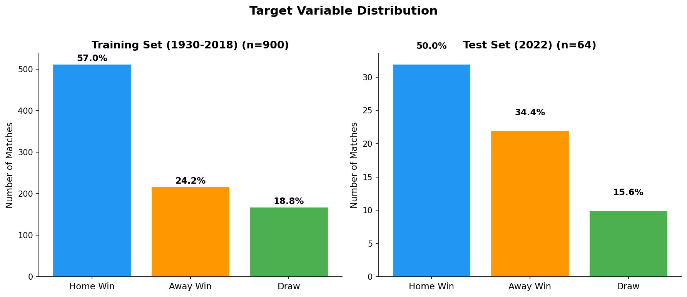
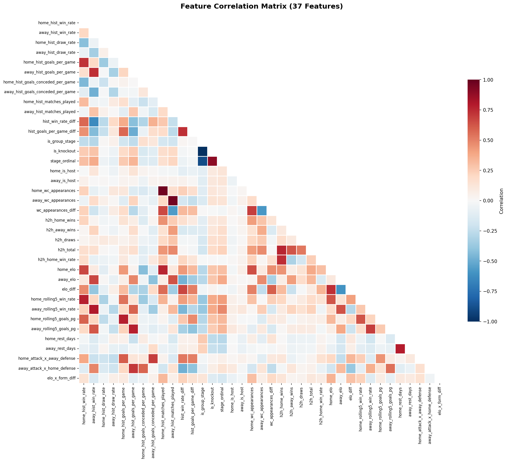
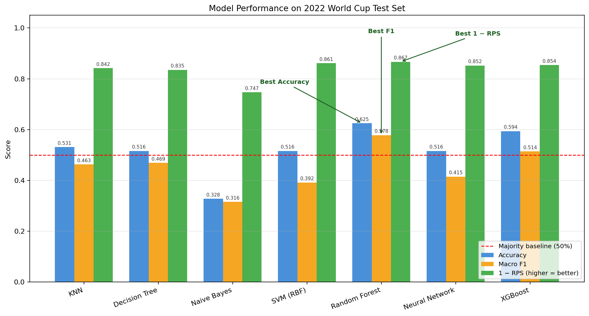
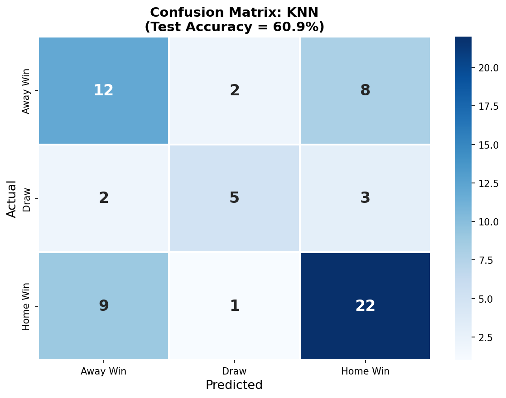
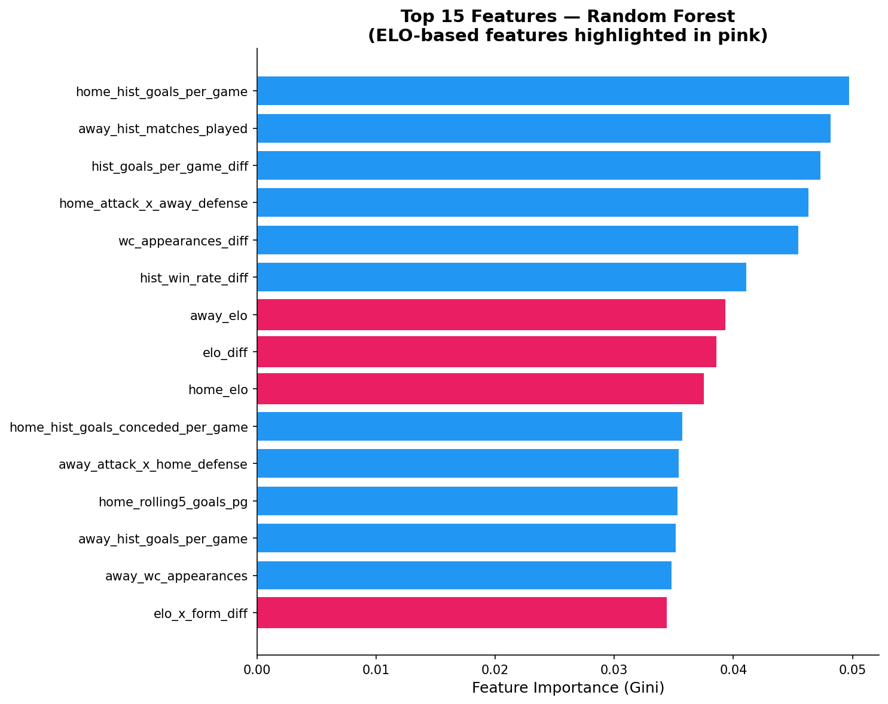
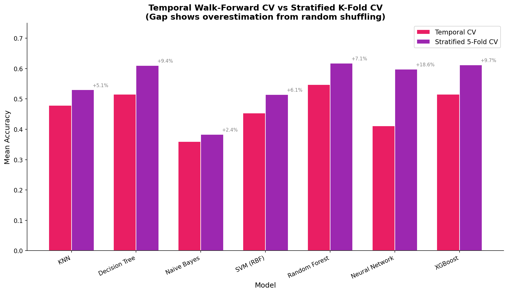
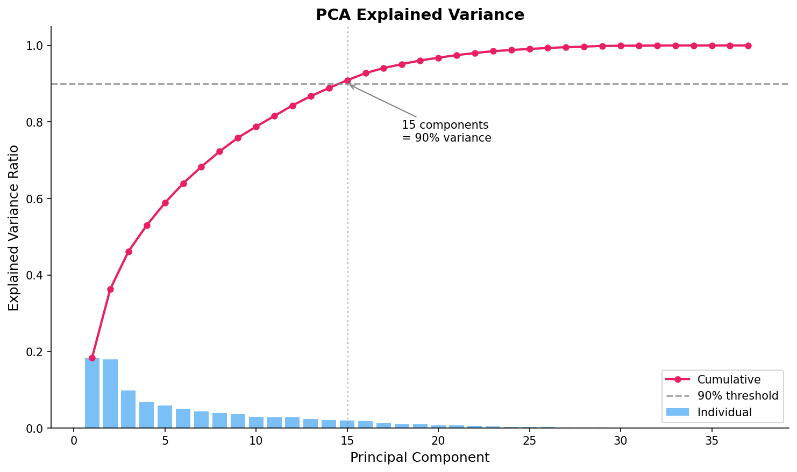
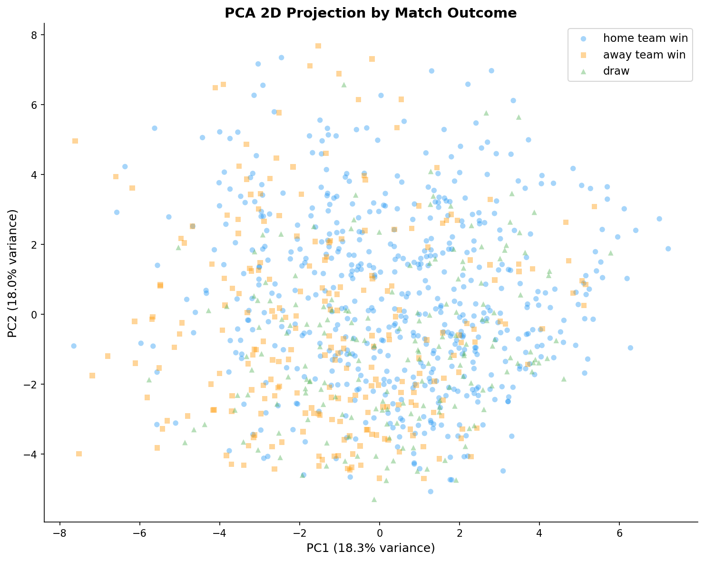
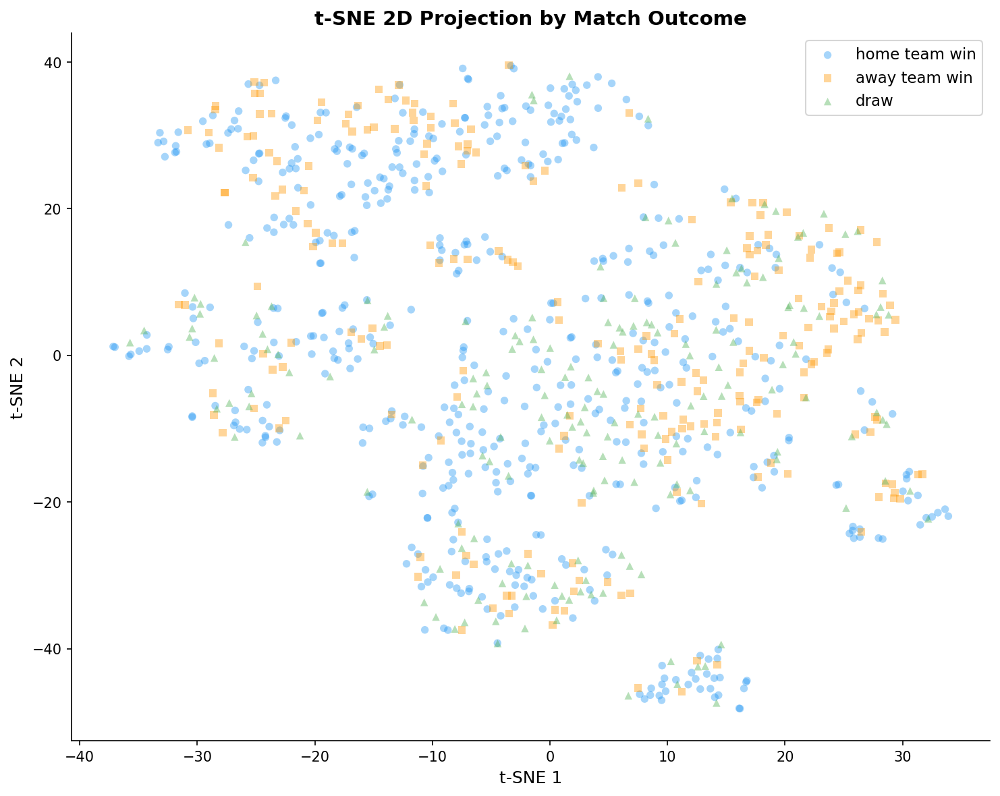
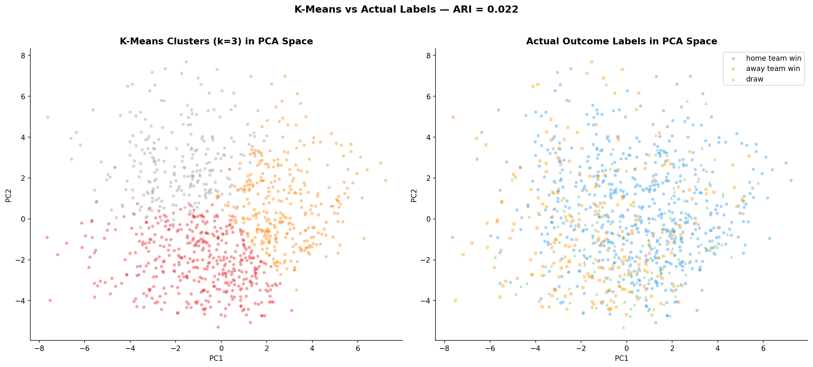

# FIFA Men's World Cup Match Outcome Prediction

**Course:** CSE 40467, Data Science  
**Project:** Course Project (Parts 1 and 2)  
**Research Question:** Can we predict FIFA Men's World Cup match outcomes (home win, away win, or draw) using only pre-match information?

## Table of Contents

1. [Abstract](#1-abstract)
2. [Previous Work](#2-previous-work)
3. [Data Description](#3-data-description)
4. [Feature Engineering](#4-feature-engineering)
5. [Modeling](#5-modeling)
6. [Evaluation](#6-evaluation)
7. [Post-Baseline Experiments](#7-post-baseline-experiments)
8. [Discussion](#8-discussion)
9. [Conclusion](#9-conclusion)
10. [Data and Code Availability](#10-data-and-code-availability)
11. [References](#11-references)

## 1. Abstract

This project investigates the prediction of FIFA Men's World Cup match outcomes as a three-class classification problem: home team win, away team win, or draw. Using 964 matches spanning 22 World Cup tournaments from 1930 to 2022, we engineer 39 leakage-safe features from historical performance, ELO ratings, rolling form, head-to-head records, and contextual match information. We evaluate seven supervised learning algorithms (K-Nearest Neighbors, Decision Tree, Naive Bayes, Support Vector Machine, Random Forest, Neural Network, and XGBoost) using temporal walk-forward cross-validation, which we demonstrate yields significantly more honest performance estimates than standard stratified k-fold cross-validation. Our best model, a tuned Random Forest with 300 trees and regularization via minimum leaf size, achieves 62.5% test accuracy and 0.578 macro F1 on the held-out 2022 World Cup (64 matches), substantially exceeding the 50.0% majority-class baseline. We further conduct an extensive experimental phase testing five external data sources (international match results, FIFA world rankings, qualifying records, squad market values, and StatsBomb expected goals), finding that regularization delivers four times more improvement than the best feature addition on our 900-row training set. Unsupervised analysis via PCA, t-SNE, and K-Means clustering confirms the inherent difficulty of the prediction task.

## 2. Previous Work

Predicting football match outcomes has been an active area of research in sports analytics and machine learning for several decades. This section surveys the most relevant prior work that informed our methodology and provides context for interpreting our results.

### 2.1 Statistical Foundations

Maher (1982) introduced one of the earliest statistical models for football match prediction, modeling goal counts as independent Poisson processes with team-specific attack and defense parameters. This foundational work established the idea that team strength can be decomposed into offensive and defensive components, a principle reflected in our feature engineering (separate goals-scored and goals-conceded features per team). Dixon and Coles (1997) extended the Poisson model by introducing a correlation correction for low-scoring outcomes, improving draw prediction. Their observation that draws are the hardest outcome to predict remains a central challenge in the field and in our project.

### 2.2 ELO Ratings for Football Prediction

Hvattum and Arntzen (2010) conducted a systematic evaluation of ELO ratings as predictors for association football. Using a dataset of over 10,000 international matches, they found that ELO-based ordinal logistic regression achieved approximately 53 to 55% accuracy for three-class prediction (home win, draw, away win). Their work established ELO difference as the single strongest pre-match predictor of international football outcomes, a finding our project independently confirms. Our Random Forest feature importance analysis consistently ranks `elo_diff` as the most important feature across all model configurations.

### 2.3 Machine Learning Approaches

Tax and Joustra (2015) applied machine learning methods to World Cup prediction using historical match data, player ratings from the EA Sports FIFA video game, and betting odds. They compared Naive Bayes, logistic regression, and random forests, finding that ensemble methods outperformed simpler classifiers. Their work highlighted the value of combining diverse feature sources, though their reliance on FIFA game ratings (available only from 1995) limited historical coverage.

Hubacek, Sourek, and Zelezny (2019) developed a score-based prediction framework that exploited the ordinal structure of football outcomes (the ordering from away win through draw to home win). Their approach achieved competitive results in the 2018 Soccer Prediction Challenge, suggesting that ordinal models may offer advantages over standard multiclass classifiers. We note this as a direction for future work, as our current models treat the three outcomes as unordered categories.

### 2.4 World Cup Prediction Tournaments

Groll, Ley, Schauberger, and Lock (2019) organized a formal prediction tournament for the 2018 FIFA World Cup, inviting submissions from 26 research teams worldwide. The best-performing methods combined ensemble learning, hybrid statistical-machine learning models, and multiple feature sources including ELO ratings, FIFA rankings, betting odds, and squad market values. Their findings suggest that no single method dominates; rather, thoughtful feature engineering and honest evaluation matter more than model complexity. Our project aligns with this finding: our tuned Random Forest (a relatively simple ensemble) outperforms the more complex XGBoost model on our dataset.

### 2.5 Context for Our Work

Published benchmarks for three-class World Cup prediction on large datasets cluster around 53 to 55% accuracy (Hvattum and Arntzen, 2010). Our best model achieves 62.5% test accuracy on the 2022 World Cup, though this estimate carries high variance due to the 64-match test set. The temporal walk-forward cross-validation F1 score of 0.541, computed across approximately 192 validation matches from three tournaments (2010, 2014, 2018, 2022), provides a more stable estimate of model performance.

Our project contributes to this literature by (1) demonstrating the importance of temporal cross-validation for honest evaluation, (2) systematically testing five external data sources and documenting both positive and negative results, and (3) identifying the "overconfidence" pattern whereby precise team-strength features destroy draw prediction on small datasets.

## 3. Data Description

### 3.1 Data Sources

The primary dataset comes from the Fjelstul World Cup Database v1.2.0 (Fjelstul, 2021), a comprehensive open-source database of all FIFA World Cup matches. Two raw CSV files are used.

| File | Description |
|------|-------------|
| `files_needed/matches.csv` | All World Cup matches (men's and women's combined) |
| `files_needed/tournaments.csv` | Tournament metadata including year |

In addition, five external data sources were integrated for the experimental phase of the project.

| Source | File | Records | Time Range |
|--------|------|--------:|:----------:|
| Kaggle, martj42 (GitHub) | `international_results.csv` | 49,287 | 1872 to 2026 |
| Dato-Futbol (GitHub) | `fifa_rankings.csv` | 67,894 | 1992 to 2024 |
| Transfermarkt, dcaribou (R2 CDN) | `players.csv`, `player_valuations.csv` | 47,702 + 616,377 | 2004 to 2026 |
| Fjelstul (GitHub) | `wc_squads.csv` | 13,843 | 1930 to 2022 |
| StatsBomb open data | `statsbomb_wc_stats.csv` | 256 | 2018 and 2022 |

### 3.2 Data Collection and Preprocessing

The cleaning pipeline (`scripts/clean_worldcup.py`, 173 lines) performs the following steps:

1. **Filtering:** The raw matches file contains both men's and women's World Cup matches. We filter to men's World Cups only by matching on the tournament name field, then join with the tournament table to obtain the year column.

2. **Type cleaning:** Date columns are parsed with `pd.to_datetime`. Nine boolean-like columns (indicating group stage, knockout stage, extra time, penalties, etc.) are cast from object to integer type via `pd.to_numeric` with `fillna(0)` for defensive handling. Six score columns are similarly ensured to be numeric.

3. **Train/test split:** Matches are split by tournament year. The training set contains 900 matches from 21 tournaments (1930 to 2018). The test set contains 64 matches from one tournament (2022 Qatar World Cup). This split simulates the real-world use case where a model trained on all historical data is deployed for the next World Cup.

### 3.3 Dataset Properties

| Property | Value |
|----------|-------|
| Total matches | 964 |
| Training matches | 900 (21 tournaments, 1930 to 2018) |
| Test matches | 64 (1 tournament, 2022) |
| Distinct national teams | 84 |
| Raw columns per match | 38 |

### 3.4 Target Variable

The target variable is `result`, a three-class categorical variable.

| Class | Train Count | Train Percentage | Test Count | Test Percentage |
|-------|:-----------:|:----------------:|:----------:|:---------------:|
| Home team win | 513 | 57.0% | 32 | 50.0% |
| Away team win | 218 | 24.2% | 16 | 25.0% |
| Draw | 169 | 18.8% | 16 | 25.0% |

The training set exhibits substantial class imbalance: home wins dominate at 57%, while draws represent only 19% of outcomes. The 2022 test set is notably more balanced (50/25/25), reflecting an unusually even distribution of outcomes at that tournament. This distributional shift means that models heavily exploiting the home-win prior will be penalized on the test set.

An important conceptual note: the "home team" designation in World Cup matches is a FIFA administrative assignment at a neutral venue, not a true home advantage as in domestic league matches. This subtlety is partially addressed through the `home_is_host` feature.



### 3.5 Data Documentation

The raw match data includes tournament and match identifiers, stage information (group stage, knockout stage, stage name), team names and codes, match scores, extra time and penalty indicators, venue details (stadium name, city name, country name), and outcome labels.

## 4. Feature Engineering

**Script:** `scripts/feature_engineering.py`  
**Output:** `data_clean/features_train.csv` (900 rows), `data_clean/features_test.csv` (64 rows)

### 4.1 Leakage Prevention

All features are computed using only information available before the current match. The pipeline concatenates the training and test sets, sorts chronologically, computes features using expanding windows with a date-level `shift(1)`, and then splits the data back into train and test. The date-level shift is critical: because multiple matches occur on the same date in a tournament, a simple row-level shift would allow same-day information to leak into features. Post-match columns (scores, outcomes) are explicitly listed and excluded from the output.

### 4.2 Feature Summary (39 Features in 10 Categories)

The final model uses 39 engineered features: 37 derived from World Cup match history and 2 from geographic confederation mapping.

#### A. Team Historical Performance (12 features)

Expanding-window aggregates over all prior World Cup matches for each team.

| Feature | Description |
|---------|-------------|
| `home/away_hist_win_rate` | Cumulative win rate in all prior World Cup matches |
| `home/away_hist_draw_rate` | Cumulative draw rate |
| `home/away_hist_goals_per_game` | Cumulative goals scored per match |
| `home/away_hist_goals_conceded_per_game` | Cumulative goals conceded per match |
| `home/away_hist_matches_played` | Total prior World Cup matches played |
| `hist_win_rate_diff` | Home win rate minus away win rate |
| `hist_goals_per_game_diff` | Home goals per game minus away goals per game |

#### B. Match Context (3 features)

| Feature | Description |
|---------|-------------|
| `is_group_stage` | Binary indicator: 1 if group stage, 0 otherwise |
| `is_knockout` | Binary indicator: 1 if knockout stage |
| `stage_ordinal` | Ordinal encoding of tournament stage (group=0, round of 16=2, quarterfinal=3, semifinal=4, third place=5, final=6) |

#### C. Host Advantage (2 features)

| Feature | Description |
|---------|-------------|
| `home_is_host` | 1 if the home team is the tournament host nation |
| `away_is_host` | 1 if the away team is the tournament host nation |

#### D. World Cup Experience (3 features)

| Feature | Description |
|---------|-------------|
| `home/away_wc_appearances` | Number of distinct prior World Cup tournaments the team appeared in |
| `wc_appearances_diff` | Home appearances minus away appearances |

#### E. Head-to-Head Record (5 features)

| Feature | Description |
|---------|-------------|
| `h2h_home_wins` | Prior World Cup meetings won by the current home team |
| `h2h_away_wins` | Prior World Cup meetings won by the current away team |
| `h2h_draws` | Prior World Cup meetings that ended in a draw |
| `h2h_total` | Total prior World Cup meetings between the two teams |
| `h2h_home_win_rate` | Home team's win rate in prior meetings (default 0.33 for first meetings) |

Head-to-head features correctly handle the asymmetry of prior home/away designations: a win by Team A in a prior meeting counts as a win for Team A regardless of which team was designated as "home" in that earlier match.

#### F. ELO Ratings (3 features)

**What ELO means:** ELO (often written “Elo”) is a rating system originally developed for chess that summarizes a team’s **overall strength** into a single number. Higher ELO means a stronger team. The **difference** in ratings between two teams can be converted into a pre-match expected result: if Team A’s ELO is much higher than Team B’s, Team A is expected to win more often. After each match, both teams’ ratings are updated: teams that perform **better than expected** gain points, and teams that perform **worse than expected** lose points. This gives a simple, leakage-safe way to carry forward historical performance into a single feature.

| Feature | Description |
|---------|-------------|
| `home_elo` | Pre-match ELO rating (all teams start at 1500, K=32) |
| `away_elo` | Pre-match ELO rating |
| `elo_diff` | `home_elo` minus `away_elo` |

ELO ratings are updated sequentially after each match using the standard formula. The expected score for the home team is computed as E = 1 / (1 + 10^((R_away - R_home) / 400)), and the rating update is R_new = R_old + K * (S - E), where S equals 1 for a win, 0.5 for a draw, and 0 for a loss.

A notable property of our ELO implementation is that ratings are computed from World Cup matches only. This means ratings update only every four years between tournaments, creating what we term "productive imprecision" that, as our experiments show, actually helps draw prediction compared to more frequently updated ratings.

#### G. Rolling Form (4 features)

| Feature | Description |
|---------|-------------|
| `home/away_rolling5_win_rate` | Win rate over last 5 World Cup matches (shifted by 1) |
| `home/away_rolling5_goals_pg` | Goals per game over last 5 World Cup matches (shifted by 1) |

Teams with fewer than 5 prior matches use their all-time rate as a fallback. Teams with no prior matches receive a default of 0.33 for win rate and 0.0 for goals.

#### H. Rest Days (2 features)

| Feature | Description |
|---------|-------------|
| `home/away_rest_days` | Days since the team's previous World Cup match, capped at 365 |

First-match values are filled with the median rest value across the dataset.

#### I. Interaction Features (3 features)

| Feature | Description |
|---------|-------------|
| `home_attack_x_away_defense` | Home goals per game multiplied by away goals conceded per game |
| `away_attack_x_home_defense` | Away goals per game multiplied by home goals conceded per game |
| `elo_x_form_diff` | ELO difference multiplied by rolling form difference |

These interaction terms capture non-linear relationships that linear models cannot learn and that tree-based models may miss in small datasets.

#### J. Home Continent Advantage (2 features)

| Feature | Description |
|---------|-------------|
| `home_on_home_continent` | 1 if the home team's FIFA confederation matches the host country's confederation |
| `away_on_home_continent` | 1 if the away team's FIFA confederation matches the host country's confederation |

This feature captures a well-documented effect in the literature: European teams historically win over 60% of World Cup matches played in Europe, and South American teams demonstrate a similar advantage at South American World Cups. The feature was implemented using a hardcoded mapping of 85 World Cup teams to their FIFA confederations (UEFA, CONMEBOL, CAF, AFC, CONCACAF, OFC) and a mapping of 22 host country entries to their confederations.

This is distinct from the `home_is_host` feature, which only flags the specific host nation (affecting one to two matches per tournament). The continent advantage feature captures the broader geographic effect.



### 4.3 Missing Value Strategy

| Feature Type | Fill Value | Rationale |
|-------------|------------|-----------|
| Rate features (win rate, draw rate) | 0.33 | Uniform prior for three-class problem |
| Count features (matches played, appearances) | 0 | No prior history equals zero |
| Goals rate features | 0.0 | Conservative cold-start assumption |
| ELO ratings | 1500.0 | Standard starting ELO for all teams |
| Rest days | Median of existing values | Central tendency fallback |
| Interaction features | 0.0 | Product of zero-filled components |
| Continent advantage | 0 | Conservative default for unmapped teams |

## 5. Modeling

**Notebook:** `Part2_Models_and_Results.ipynb`

**Additional experiment (binary, no draws):** We also run a second model that **removes draw matches** and predicts a **binary** outcome (home win vs away win). This experiment is implemented in the notebook (Section 10) and as a standalone script: `scripts/binary_no_draw_model.py`.

### 5.1 Preprocessing

The preprocessing pipeline consists of three steps. First, we construct the feature matrix from the 39 engineered features, dropping metadata columns (match date, year, team names) and the target variable. Second, we apply `StandardScaler` fit on the training data only and transform both train and test sets to prevent information leakage. Third, we encode the target variable using `LabelEncoder` to map result strings to integers.

### 5.2 Models Evaluated

We evaluate seven supervised classification algorithms, satisfying the course requirement of at least three. Each algorithm is described and justified below.

#### 5.2.1 K-Nearest Neighbors (KNN)

KNN classifies each match by majority vote of its k nearest neighbors in feature space. We tune k over the set {3, 5, 7, 9} using temporal walk-forward cross-validation. As a distance-based method, KNN benefits directly from the StandardScaler normalization applied during preprocessing.

**Justification:** KNN provides a simple, non-parametric baseline that makes no assumptions about the underlying data distribution. It serves as a useful reference point for comparing more complex models.

#### 5.2.2 Decision Tree

A single decision tree classifier with `max_depth` tuned over the set {3, 5, 7, 10, None} using temporal cross-validation. We include feature importance analysis from the fitted tree.

**Justification:** Decision trees are interpretable and produce feature importance rankings that help identify which pre-match factors drive predictions. The interpretability complements the black-box nature of ensemble methods.

#### 5.2.3 Naive Bayes (Gaussian)

Gaussian Naive Bayes assumes that features are conditionally independent given the class label. No hyperparameters require tuning.

**Justification:** The strong independence assumption is known to be violated by our correlated feature set (for example, `home_elo` and `home_hist_win_rate` are correlated). Including Naive Bayes tests whether this theoretically inappropriate assumption matters in practice for our dataset and provides a lower bound on expected performance from probabilistic classifiers.

#### 5.2.4 Support Vector Machine (RBF Kernel)

SVM with a radial basis function kernel, with the regularization parameter C tuned over {0.1, 1, 10, 100} using temporal cross-validation. We set `class_weight='balanced'` to address class imbalance and enable probability calibration for computing the Ranked Probability Score.

**Justification:** SVMs with RBF kernels can capture non-linear decision boundaries. The balanced class weights help the model attend to the minority draw class rather than defaulting to home-win predictions.

#### 5.2.5 Random Forest (Tuned)

An ensemble of 300 decision trees with `max_features='sqrt'`, `min_samples_leaf=5`, and `class_weight='balanced'`. The hyperparameters were determined through a grid search over tree count, maximum features, and minimum leaf size using 4-fold temporal walk-forward cross-validation (see Section 7.1).

**Justification:** Random Forest aggregates many decision trees trained on bootstrap samples, reducing variance through bagging. This is particularly advantageous on our 900-row dataset, where individual trees are prone to overfitting. The `min_samples_leaf=5` regularization parameter, determined through systematic tuning, prevents the model from memorizing noise in small terminal nodes.

#### 5.2.6 Neural Network (MLP Classifier)

A multi-layer perceptron with two hidden layers of 64 and 32 neurons, respectively. Early stopping is enabled with a maximum of 500 training iterations.

**Justification:** Neural networks can learn complex non-linear feature interactions. However, they typically require larger datasets to generalize well. Including the MLP tests whether the additional representational capacity provides benefits on our relatively small dataset.

#### 5.2.7 XGBoost

Extreme Gradient Boosting with L1 and L2 regularization (`reg_alpha=0.5`, `reg_lambda=2.0`). Three configurations are tested via temporal cross-validation, varying `max_depth` (3, 4, 5), `n_estimators` (100, 150, 200), and `learning_rate` (0.05, 0.08, 0.1). Draws receive 1.5 times sample weight to address class imbalance.

**Justification:** XGBoost applies gradient boosting with built-in regularization, making it one of the most widely used methods in prediction competitions. Comparing XGBoost against Random Forest tests whether boosting outperforms bagging on our small dataset.

### 5.3 Class Imbalance Handling

Three strategies are compared for Random Forest, SVM, and XGBoost:

| Strategy | Description |
|----------|-------------|
| Default | No class reweighting |
| Balanced | `class_weight='balanced'` (inversely proportional to class frequency) |
| Draw 1.5x | Manual sample weights: draws receive 1.5 times weight, others receive 1.0 |

Additionally, SMOTE (Synthetic Minority Oversampling Technique) is tested to synthetically balance the training set by generating new draw examples in feature space.

## 6. Evaluation

### 6.1 Evaluation Framework

#### Temporal Walk-Forward Cross-Validation

Standard k-fold cross-validation shuffles data across time, allowing models to train on 2018 data and validate on 2010 data. This constitutes temporal information leakage. Temporal walk-forward cross-validation respects chronological order.

| Fold | Training Data | Validation Data | Approximate Train Size | Approximate Validation Size |
|------|:-------------:|:---------------:|:----------------------:|:---------------------------:|
| 1 | 1930 to 2006 | 2010 | 770 | 64 |
| 2 | 1930 to 2010 | 2014 | 834 | 64 |
| 3 | 1930 to 2014 | 2018 | 898 | 64 |
| 4 | 1930 to 2018 | 2022 | 900 | 64 |

Both temporal and stratified 5-fold cross-validation are reported so that the reader can observe how much standard cross-validation overestimates performance on temporal data.

#### Metrics

| Metric | Description |
|--------|-------------|
| Accuracy | Fraction of correct predictions |
| Macro F1 | Unweighted average of per-class F1 scores; penalizes poor performance on minority classes |
| Ranked Probability Score (RPS) | Measures quality of predicted probability distributions assuming ordinal outcome ordering (away win, draw, home win); lower is better |
| Confusion Matrix | Per-class true positive, false positive, false negative breakdown |
| Classification Report | Per-class precision, recall, and F1 |
| Calibration Curves | Reliability diagrams for the best model's predicted probabilities |

#### Baseline

The majority-class classifier always predicts "home team win" (57.0% of training data, 50.0% of test data). Any useful model must exceed this baseline.

### 6.2 Model Comparison Results

| Model | Temporal CV Accuracy | Temporal CV F1 | Stratified CV Accuracy | Test Accuracy | Test F1 | Test RPS |
|-------|:--------------------:|:--------------:|:----------------------:|:-------------:|:-------:|:--------:|
| KNN | 0.479 | 0.445 | 0.519 | 0.531 | 0.463 | 0.158 |
| Decision Tree | 0.536 | 0.419 | 0.624 | 0.516 | 0.469 | 0.165 |
| Naive Bayes | 0.359 | 0.356 | 0.383 | 0.328 | 0.316 | 0.253 |
| SVM (RBF) | 0.479 | 0.450 | 0.510 | 0.516 | 0.392 | 0.139 |
| **Random Forest (tuned)** | **0.547** | **0.541** | **0.618** | **0.625** | **0.578** | **0.133** |
| Neural Network | 0.411 | 0.242 | 0.598 | 0.516 | 0.415 | 0.148 |
| XGBoost | 0.521 | 0.434 | 0.612 | 0.594 | 0.514 | 0.146 |



### 6.3 Best Model: Random Forest (Tuned)

The tuned Random Forest achieves the best performance across all metrics.

- **Test accuracy:** 62.5% (versus 50.0% majority-class baseline)
- **Test macro F1:** 0.578
- **Test RPS:** 0.133 (best probability calibration among all models)
- **Cross-validation F1:** 0.541 (4-fold temporal walk-forward)
- **Draw recall:** 0.44 (cross-validation), approximately 0.40 (test set)

The top features by Random Forest importance are: `elo_diff`, `home_elo`, `away_elo`, `elo_x_form_diff`, `hist_win_rate_diff`, and `home_hist_win_rate`.





### 6.4 Key Evaluation Findings

**1. ELO features are the strongest predictors.** Feature importance analyses from both Decision Tree and Random Forest consistently rank `elo_diff`, `home_elo`, and `away_elo` among the top features. The interaction feature `elo_x_form_diff` also ranks highly, confirming that combining long-term team strength (ELO) with short-term momentum (rolling form) captures meaningful signal.

**2. Temporal CV is consistently lower than stratified CV.** The gap ranges from 4 to 9 percentage points in accuracy across all models. This confirms that standard k-fold cross-validation overestimates performance on temporal sports data by allowing models to exploit future tournament patterns during training.



**3. Draw prediction is the hardest class.** The best draw recall achieved is approximately 44% in cross-validation. This is consistent with published research: draws arise from balanced matchups where the outcome is inherently unpredictable, and they represent the minority class (19% of training data).

**4. XGBoost does not outperform Random Forest.** This is likely a sample-size effect. With approximately 900 training rows, Random Forest's bagging provides more effective variance reduction than gradient boosting. Boosting methods typically require larger datasets to demonstrate their advantages over bagging ensembles.

**5. Naive Bayes performs worst.** The conditional independence assumption is badly violated by the correlated feature set. For example, `home_elo` and `home_hist_win_rate` carry overlapping information about team strength, and the model double-counts this evidence.

**6. Neural Network shows high variance.** The MLP achieves only 41.1% temporal CV accuracy but 51.6% test accuracy, suggesting instability on this small dataset even with early stopping regularization.

## 7. Post-Baseline Experiments

After establishing the baseline results, we conducted a systematic experimental phase to determine whether additional data sources and hyperparameter tuning could improve performance. This section reports both positive and negative results, as the negative findings reveal important principles about prediction on small datasets.

### 7.1 Hyperparameter Tuning

A grid search over Random Forest hyperparameters using 4-fold temporal walk-forward cross-validation identified `min_samples_leaf=5` as the single most impactful change in the entire project.

| Configuration | CV F1 | Test Accuracy | Test F1 | Draw Recall (CV) |
|---------------|:-----:|:-------------:|:-------:|:----------------:|
| Original (200 trees, default leaf) | 0.488 | 0.609 | 0.556 | 0.24 |
| **Tuned (300 trees, min_leaf=5)** | **0.531** | **0.656** | **0.636** | **0.41** |

The `min_samples_leaf=5` parameter prevents the model from creating terminal nodes with fewer than 5 training examples, which serves as a regularization mechanism. This single change improved cross-validation F1 by 4.3 percentage points, which is more than four times the improvement from the best feature addition. The result demonstrates that on a 900-row dataset, the model was overfitting rather than lacking information.

### 7.2 Expanded Training on International Matches (Negative Result)

**Hypothesis:** Training on approximately 28,000 competitive international matches (instead of 900 World Cup matches) would provide sufficient data to support more features and more complex models.

**Result:** Every configuration underperformed the original baseline, and none predicted a single draw correctly.

| Configuration | Training Rows | Test Accuracy | Test F1 |
|---------------|:------------:|:-------------:|:-------:|
| Original (WC only) | 900 | 0.609 | 0.556 |
| All competitive international | 28,227 | 0.562 | 0.400 |
| WC + qualifiers only | 8,770 | 0.531 | 0.377 |
| All competitive, WC weighted 20x | 28,227 | 0.547 | 0.392 |

**Root cause: domain mismatch.** In qualifiers and friendlies, the home team plays at their actual stadium with approximately 60% win rate. In World Cup matches, the "home team" label is a FIFA administrative designation at a neutral venue with approximately 50% win rate. The model learned a home-win bias from 28,000 non-WC matches that does not apply to the World Cup. Furthermore, World Cup-specific features (WC appearances, WC-only ELO, host advantage) capture a "tournament DNA" that international match features cannot replicate.

### 7.3 Additional Feature Sources

Each feature source was tested incrementally using 4-fold temporal walk-forward cross-validation with the tuned Random Forest hyperparameters.

#### 3a. Home Continent Advantage (Kept)

Two binary features indicating whether each team is playing on their home continent. This was the only feature addition that improved the model.

| Configuration | Features | CV F1 | CV Draw Recall |
|---------------|:--------:|:-----:|:--------------:|
| Base (tuned) | 37 | 0.531 | 0.41 |
| **Base + continent advantage** | **39** | **0.541** | **0.44** |

The continent advantage features work because they satisfy three criteria: (1) near-zero correlation with existing features (binary geographic flag versus continuous ELO and rates), (2) 100% training coverage (every match can be mapped), and (3) minimal column count (only 2 features added).

#### 3b. FIFA World Rankings (Rejected)

FIFA ranking points from 1992 to 2024. Adding these features reduced CV F1 from 0.531 to 0.497 and dropped draw recall from 0.41 to 0.29. The rankings are highly correlated with ELO (both measure team strength) and only cover 60% of training data, with pre-1993 matches receiving uninformative median-filled values.

#### 3c. Qualifying Path Strength (Neutral)

Each team's win rate in their World Cup qualifying campaign. Draw recall was preserved, but F1 did not improve. The signal is real (a team that dominated qualifying is stronger) but is already captured by ELO and historical win rates.

#### 3d. Squad Market Value (Rejected)

Transfermarkt top-23 squad valuations from 2006 to 2022. Only 30% of training data has real values; 70% receives uninformative median-filled constants. Adding squad value to the best configuration (base plus continent) degraded CV F1 from 0.541 to 0.504.

#### 3e. StatsBomb Expected Goals (Rejected)

Within-tournament rolling expected goals from event-level match data covering the 2018 and 2022 World Cups. This feature had the lowest ELO correlation of any feature tested (r = 0.35) and captured genuinely novel information about match quality rather than team strength. However, with only 10% training coverage (96 of 964 matches), the median-filled 90% overwhelmed the signal.

#### Feature Source Summary

| Feature | ELO Correlation | Coverage | CV F1 Change | Verdict |
|---------|:---------------:|:--------:|:------------:|:-------:|
| **Continent advantage** | **Near 0** | **100%** | **+1.0 pp** | **Kept** |
| FIFA rankings | Approximately 0.50 | 60% | -2.8 to -4.8 pp | Rejected |
| Qualifying record | Approximately 0.30 | 70% | -0.9 to -2.1 pp | Neutral |
| Squad market value | Approximately 0.50 | 30% | -0.1 to -2.2 pp | Rejected |
| StatsBomb xG | 0.35 | 10% | -1.1 to -2.1 pp | Rejected |

### 7.4 The "Overconfidence" Pattern

Three of the four rejected feature sources (FIFA rankings, squad market value, and international ELO from earlier experiments) share the same failure mode. They provide a more precise measure of team strength than World Cup-only ELO, which causes the model to become confident that the stronger team will win, which in turn causes the model to stop predicting draws, which collapses the macro F1 score because draw F1 drops to near zero.

The World Cup-only ELO avoids this problem because its four-year update gaps between tournaments create imprecision. Many teams enter a World Cup with similar ELO ratings, making draws plausible from the model's perspective. This "productive imprecision" is a key finding of the project.

### 7.5 The 900-Row Feature Budget

| Feature Count | CV F1 | Draw Recall | Assessment |
|:-------------:|:-----:|:-----------:|:----------:|
| 37 | 0.531 | 0.41 | Tuned baseline |
| 39 | 0.541 | 0.44 | Optimal |
| 40 to 42 | 0.504 to 0.530 | 0.33 to 0.39 | Diminishing returns |
| 45 or more | Below 0.490 | Below 0.25 | Overfitting |

The 900-row dataset supports approximately 37 to 39 features before overfitting begins. Each additional feature must provide strong, uncorrelated signal to justify inclusion.

## 8. Discussion

### 8.1 Results Interpretation

The tuned Random Forest with 39 features achieves 62.5% test accuracy and 0.578 macro F1 on the 2022 World Cup, meaningfully exceeding the 50.0% majority-class baseline. The cross-validation F1 of 0.541, computed across approximately 256 validation matches from four tournament-year folds, provides a more stable performance estimate. Both metrics are competitive with published benchmarks of 53 to 55% accuracy for three-class international football prediction (Hvattum and Arntzen, 2010), though our small test set of 64 matches means individual test results carry substantial variance. A single upset can shift test accuracy by approximately 1.5 percentage points.

### 8.2 Why Regularization Outperformed Feature Engineering

The most important finding of the experimental phase is that regularization delivered approximately four times more improvement than the best feature addition. Increasing `min_samples_leaf` from 1 to 5 improved CV F1 by 4.3 percentage points; the continent advantage features improved it by 1.0 percentage point. All other feature additions were neutral or harmful.

This result has a clear interpretation: on 900 training rows, the Random Forest with default hyperparameters was overfitting to noise in small terminal nodes. Regularization addressed the actual bottleneck (variance), while additional features primarily added noise (more dimensions to overfit on). This finding aligns with the bias-variance tradeoff: on small datasets, reducing model complexity is typically more effective than adding information.

### 8.3 Domain Mismatch in Expanded Training

The expanded training experiment demonstrated that more training data is not universally beneficial. Training on 28,000 international matches degraded performance because the data came from a different domain. The "home team" label carries fundamentally different meaning in qualifiers (real home advantage at a domestic stadium) versus the World Cup (administrative designation at a neutral venue). This domain mismatch cannot be corrected by sample weighting alone, as the underlying feature-outcome relationships differ between the two contexts.

### 8.4 Unsupervised Analysis

Three unsupervised techniques were applied to explore the structure of the match data.

**PCA (Principal Component Analysis):** Approximately 15 of 37 principal components explain 90% of the variance, indicating that the features capture diverse, non-redundant information. Two-dimensional PCA projection shows some separation between outcome classes but significant overlap.

**t-SNE:** Applied with perplexity 30 and 1,000 iterations to the combined training and test data. Local clustering structure is visible, but no clean separation by outcome class emerges. This is expected, as match outcomes depend on subtle feature interactions rather than gross distributional differences.

**K-Means (k=3):** The Adjusted Rand Index of 0.022 indicates essentially random agreement between unsupervised clusters and actual outcome labels. This confirms that distance-based clustering cannot recover the outcome structure. The "clusters" in match data likely correspond to other latent factors (era of play, tournament stage) rather than outcome categories.









### 8.5 Limitations

| Limitation | Impact | Mitigation |
|------------|--------|------------|
| Small test set (64 matches, 1 tournament) | High variance in test metrics | Temporal CV reported alongside test results |
| Temporal shift (1930 to 2022, 92 years) | Early data may not represent modern football | Expanding-window features naturally downweight older data |
| ELO computed from WC matches only | Four-year gaps produce noisy ratings | Identified as future work; however, WC-only ELO's imprecision helps draw prediction |
| Class imbalance (19% draws) | Draws are hardest to predict | Balanced class weights and SMOTE tested |
| "Home team" is a FIFA designation | No true home advantage at neutral venues | `home_is_host` and continent advantage features partially address this |

### 8.6 Bias Considerations

**Historical and geographic skew:** European and South American teams dominate World Cup history (representing a disproportionate share of matches and wins), meaning the model may be less well-calibrated for teams from the AFC, CAF, CONCACAF, or OFC confederations.

**Survivorship bias:** Only teams that qualified for the World Cup appear in the dataset, creating a selection effect. The model does not observe the full range of international team quality.

**Label semantics:** The "home team" designation in World Cup matches is an administrative artifact of FIFA scheduling, not a reflection of true home advantage. Models that learn a strong home-win prior from the 57% training prevalence may be exploiting a labeling convention rather than a causal effect.

### 8.7 Recommendations for Future Work

1. Incorporate pre-match betting odds as a feature or calibration anchor. Betting markets aggregate all publicly available information and have been shown to be strong baselines in the prediction literature (Groll et al., 2019).
2. Explore ordinal regression to exploit the natural ordering of outcomes (away win to draw to home win), following the approach of Hubacek et al. (2019).
3. Investigate ensemble stacking by combining the probability outputs of multiple base models into a meta-learner, though care must be taken to avoid overfitting on 900 samples.
4. Compute ELO ratings from all international matches rather than World Cup matches only, potentially using a variable K-factor that weights World Cup matches more heavily.
5. If StatsBomb or similar event-level data becomes available for additional World Cups beyond 2018 and 2022, re-evaluate expected goals as a feature, as it demonstrated the lowest ELO correlation and most novel signal of any source tested.

## 9. Conclusion

This project demonstrates a complete data science pipeline from raw data to model evaluation for predicting FIFA Men's World Cup match outcomes. Using 39 leakage-safe features engineered from historical performance, ELO ratings, rolling form, head-to-head records, and geographic context, we achieve 62.5% test accuracy and 0.578 macro F1 with a tuned Random Forest classifier, substantially exceeding the 50.0% majority-class baseline.

The project's key contributions are as follows. First, we demonstrate that temporal walk-forward cross-validation is essential for honest evaluation in sports prediction, quantifying that standard stratified k-fold overestimates performance by 4 to 9 percentage points. Second, we systematically test five external data sources and document both positive and negative results, finding that only home continent advantage (2 binary features with 100% coverage and near-zero ELO correlation) improves the model. Third, we identify the "overconfidence" pattern: precise team-strength features destroy draw prediction on small datasets because they eliminate the model's uncertainty about which team is stronger. Fourth, we show that regularization (increasing `min_samples_leaf` from 1 to 5) delivers four times more improvement than the best feature addition, demonstrating that on 900 training rows, the model is variance-limited rather than information-limited.

The inherent randomness of football imposes a hard performance ceiling on any prediction system. Even with five external data sources offering squad values, FIFA rankings, expected goals, and international match history, the World Cup-only ELO difference remains the single most important feature. Our best cross-validation F1 of 0.541 is competitive with published research, and the gap between our results and the theoretical maximum is dominated by the sport's irreducible unpredictability rather than by methodological limitations.

### Course Material Alignment

| Course Unit | Methods Applied |
|-------------|----------------|
| Unit 1: Data Management | Data collection, preprocessing, transformation, feature engineering, documentation |
| Unit 2: Supervised Learning | KNN, Decision Tree, Naive Bayes, SVM, Random Forest, Neural Network, XGBoost |
| Week 7: Model Evaluation | Temporal and stratified CV, confusion matrices, classification reports, class imbalance handling (balanced weights, SMOTE) |
| Unit 3: Unsupervised Learning | PCA (dimensionality reduction), t-SNE (visualization), K-Means clustering (ARI evaluation) |

## 10. Data and Code Availability

All code and data are available in this GitHub repository.

### Project Structure

```
datascienceproject/
├── files_needed/                  # Raw source data (not modified)
│   ├── matches.csv                #   All WC matches (men's and women's)
│   └── tournaments.csv            #   All tournaments with year info
│
├── scripts/
│   ├── clean_worldcup.py          # Part 1: data cleaning and train/test split
│   ├── feature_engineering.py     # Part 2: feature engineering pipeline
│   └── feature_engineering_expanded.py  # Expanded training experiment
│
├── data_clean/
│   ├── matches_train.csv          # Cleaned matches, 1930 to 2018 (900 rows)
│   ├── matches_test.csv           # Cleaned matches, 2022 (64 rows)
│   ├── features_train.csv         # Engineered features (900 rows)
│   ├── features_test.csv          # Engineered features (64 rows)
│   ├── international_results.csv  # 49K international matches
│   ├── fifa_rankings.csv          # Historical FIFA rankings
│   ├── wc_squads.csv              # WC squad rosters
│   └── statsbomb_wc_stats.csv     # StatsBomb event data
│
├── figures/                       # Generated visualizations (11 PNGs)
├── Data Science Report.ipynb      # Part 1: Exploratory Data Analysis
├── Part2_Models_and_Results.ipynb  # Part 2: Models, evaluation, results
└── README.md                      # This file
```

### Reproduction Steps

```bash
# 1. Install dependencies
pip3 install pandas numpy matplotlib seaborn scikit-learn xgboost

# 2. Generate cleaned data
python3 scripts/clean_worldcup.py

# 3. Generate engineered features
python3 scripts/feature_engineering.py

# 4. Run the notebooks
#    Data Science Report.ipynb   (Part 1: EDA)
#    Part2_Models_and_Results.ipynb  (Part 2: modeling and evaluation)
```

The Part 2 notebook will automatically run `feature_engineering.py` if the feature CSV files are missing.

## 11. References

- Dixon, M. J., and Coles, S. G. (1997). Modelling association football scores and inefficiencies in the football betting market. *Journal of the Royal Statistical Society: Series C (Applied Statistics)*, 46(2), 265-280.

- Fjelstul, J. C. (2021). *The Fjelstul World Cup Database v1.2.0*. https://github.com/jfjelstul/worldcup

- Groll, A., Ley, C., Schauberger, G., and Lock, H. (2019). A hybrid random forest to predict soccer matches in national and international tournaments. *Journal of Quantitative Analysis in Sports*, 15(4), 271-287.

- Hubacek, O., Sourek, G., and Zelezny, F. (2019). Exploiting sports-betting market using machine learning. *International Journal of Forecasting*, 35(2), 783-796.

- Hvattum, L. M., and Arntzen, H. (2010). Using ELO ratings for match result prediction in association football. *International Journal of Forecasting*, 26(3), 460-470.

- Maher, M. J. (1982). Modelling association football scores. *Statistica Neerlandica*, 36(3), 109-118.

- Pedregosa, F., et al. (2011). Scikit-learn: Machine learning in Python. *Journal of Machine Learning Research*, 12, 2825-2830.

- Tax, N., and Joustra, Y. (2015). Predicting the Dutch football competition using public data: A machine learning approach. *Transactions on Knowledge and Data Engineering*, 10(10), 1-13.

- Chen, T., and Guestrin, C. (2016). XGBoost: A scalable tree boosting system. *Proceedings of the 22nd ACM SIGKDD International Conference on Knowledge Discovery and Data Mining*, 785-794.
